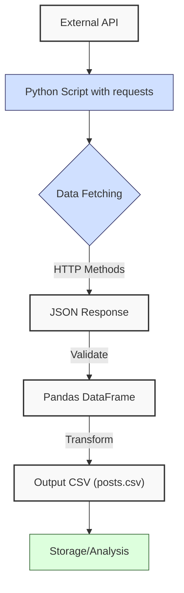
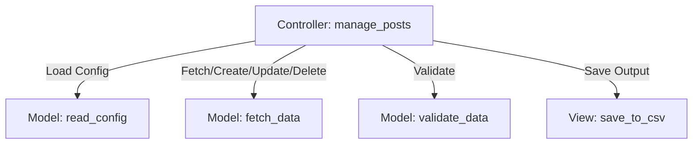
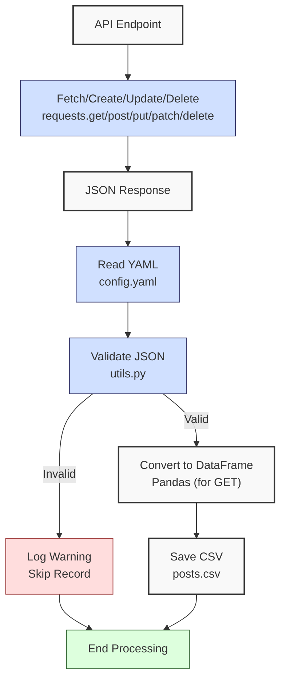

**Complexity: Moderate (M)**

## 4.0 Introduction: Why This Matters for Data Engineering

In data engineering, integrating external data sources via APIs is critical for real-time analytics in Hijra Group’s fintech ecosystem. APIs enable fetching and managing content data, such as user posts from a social media platform, to analyze engagement metrics and inform business strategies. The `requests` library simplifies HTTP requests, handling thousands of records with \~100ms latency per request, while JSON parsing integrates seamlessly with Pandas DataFrames (\~24MB for 1M rows, per Chapter 3). This chapter introduces **HTTP fundamentals**, **REST APIs**, and **MVC concepts**, building on Chapters 1–3 to fetch, validate, create, update, and delete post data from `https://jsonplaceholder.typicode.com/posts`, which returns data with fields `userId`, `id`, `title`, and `body`. This prepares you for scalable pipelines and web frameworks like FastAPI (Chapter 53).

This chapter avoids advanced concepts like type annotations (Chapter 7), testing (Chapter 9), or error handling with try/except (Chapter 7), focusing on HTTP requests, JSON processing, and basic validation. All code uses **PEP 8's 4-space indentation**, preferring spaces over tabs to avoid `IndentationError`, aligning with Hijra Group’s pipeline standards. The micro-project demonstrates all HTTP methods (GET, POST, PUT, PATCH, DELETE) using `/posts` and `/comments` endpoints, validating data and saving fetched posts to `data/posts.csv`, testing edge cases to align with Hijra Group’s content analytics needs. We assume `https://jsonplaceholder.typicode.com/posts` is always available for simplicity.

### Data Engineering Workflow Context

This diagram illustrates how APIs fit into a data engineering pipeline:



### Building On and Preparing For

- **Building On**:
  - Chapter 1: Uses dictionaries, loops, and string formatting for data processing, extended to JSON parsing and endpoint building.
  - Chapter 2: Leverages CSV handling (`csv.DictReader`), YAML/JSON parsing, and modules (`utils.py`), now applied to API data.
  - Chapter 3: Uses Pandas DataFrames for structured data, extended to API responses.
- **Preparing For**:
  - Chapter 5: Prepares for OOP by organizing API logic in modules.
  - Chapter 7: Lays groundwork for type-safe API interactions.
  - Chapter 53: Enables FastAPI development for building APIs.
  - Chapter 69–71: Supports capstone projects with real-time data fetching and management.

### What You’ll Learn

This chapter covers:

1. **HTTP and REST Basics**: Understanding requests and responses for all HTTP methods.
2. **Using** `requests`: Performing GET, POST, PUT, PATCH, and DELETE requests.
3. **JSON Processing**: Parsing API responses into dictionaries.
4. **Data Validation**: Ensuring data integrity with `utils.py`.
5. **Pandas Integration**: Converting JSON to DataFrames and CSVs.
6. **MVC Concepts**: Structuring code for scalability.

By the end, you’ll build a post data manager that retrieves, creates, updates, and deletes data using `https://jsonplaceholder.typicode.com/posts`, validates it, and saves fetched posts to `data/posts.csv`, using 4-space indentation per PEP 8. The micro-project uses `data/config.yaml`, testing edge cases to align with Hijra Group’s content analytics needs.

**Follow-Along Tips**:

- Create `de-onboarding/data/` and populate with files from Appendix 1 (`posts.csv`, `config.yaml`).
- Install libraries: `pip install requests pandas pyyaml`.
- Use **4 spaces** (not tabs) per PEP 8. Run `python -tt script.py` to detect tab/space mixing.
- Use print statements (e.g., `print(response.json())`) to debug API responses.
- Verify file paths with `ls data/` (Unix/macOS) or `dir data\` (Windows).
- Use UTF-8 encoding to avoid `UnicodeDecodeError`.
- Verify API connectivity with `curl https://jsonplaceholder.typicode.com/posts` (Unix/macOS) or `Invoke-WebRequest https://jsonplaceholder.typicode.com/posts` (Windows PowerShell) to ensure the endpoint is accessible.
- Ensure write permissions for `data/` with `ls -l data/` (Unix/macOS) or `dir data\` (Windows). If `PermissionError` occurs, check folder permissions.

## 4.1 HTTP and REST Basics

HTTP (HyperText Transfer Protocol) enables communication between clients (e.g., Python scripts) and servers (e.g., APIs). REST (Representational State Transfer) is an architectural style for APIs, using standard HTTP methods to manage resources. REST APIs return structured data (e.g., JSON), ideal for content records like user posts.

**Note**: JSONPlaceholder is a mock API; POST, PUT, PATCH, and DELETE return simulated responses but don’t persist changes. In production, these operations would modify server data.

### Key Concepts

- **HTTP Methods**:
  - **GET**: Retrieves data (e.g., fetch all posts with `/posts` or a single post with `/posts/1`).
  - **POST**: Creates a new resource (e.g., create a post with `/posts`).
  - **PUT**: Updates an existing resource by replacing it (e.g., update `/posts/1`).
  - **PATCH**: Partially updates a resource (e.g., update `/posts/1` title).
  - **DELETE**: Removes a resource (e.g., delete `/posts/1`).
- **Status Codes**:
  - 200: Success (GET, PUT, PATCH, DELETE).
  - 201: Created (POST).
  - 204: No Content (DELETE).
  - 400: Bad request (e.g., invalid parameters).
  - 404: Resource not found.
  - 500: Server error.
- **JSON**: Lightweight format for structured data, parsed into Python dictionaries.
- **REST Principles**: Stateless (each request is independent), resource-based (e.g., `/posts`, `/comments`).
- **Idempotency**: GET, PUT, and DELETE are idempotent (repeated calls produce the same result), while POST and PATCH may create or modify resources differently each time.

**Example HTTP Requests** (conceptual):

```
GET /posts HTTP/1.1
Host: jsonplaceholder.typicode.com
```

```
POST /posts HTTP/1.1
Host: jsonplaceholder.typicode.com
Content-Type: application/json

{"userId": 1, "title": "new post", "body": "content"}
```

```
PUT /posts/1 HTTP/1.1
Host: jsonplaceholder.typicode.com
Content-Type: application/json

{"userId": 1, "id": 1, "title": "updated post", "body": "new content"}
```

```
PATCH /posts/1 HTTP/1.1
Host: jsonplaceholder.typicode.com
Content-Type: application/json

{"title": "partially updated post"}
```

```
DELETE /posts/1 HTTP/1.1
Host: jsonplaceholder.typicode.com
```

**Note**: DELETE typically returns an empty response (`{}`) with status 200 or 204 to confirm success without data.

**Example JSON Responses**:

- **GET /posts** (minimal):

```json
[{ "id": 1, "title": "sunt aut facere" }]
```

- **POST /posts**:

```json
{ "userId": 1, "title": "new post", "body": "content", "id": 101 }
```

- **PUT /posts/1**:

```json
{ "userId": 1, "id": 1, "title": "updated post", "body": "new content" }
```

- **PATCH /posts/1**:

```json
{ "userId": 1, "id": 1, "title": "partially updated post", "body": "..." }
```

- **DELETE /posts/1**:

```json
{}
```

**Time/Space Complexity**:

- **Time**: O(n) for parsing n JSON records (GET, POST, PUT, PATCH); O(1) for DELETE.
- **Space**: O(n) for storing n records in memory (\~1MB for 10K JSON records with 4 fields); O(1) for DELETE.

**Implication**: REST APIs enable real-time data fetching and management for Hijra Group’s content analytics, with JSON parsing scaling linearly for typical post volumes.

## 4.2 Using the `requests` Library

The `requests` library simplifies HTTP requests. This example demonstrates all HTTP methods using `/posts`.

```python
import requests  # Import requests library

# Base URL
base_url = "https://jsonplaceholder.typicode.com"

# GET: Fetch all posts
response_get = requests.get(f"{base_url}/posts")
print("DEBUG: GET Status Code:", response_get.status_code)
if response_get.status_code == 200:
    print("DEBUG: GET Data:", response_get.json()[:2])

# GET: Fetch single post
response_get_single = requests.get(f"{base_url}/posts/1")
print("DEBUG: GET Single Status Code:", response_get_single.status_code)
if response_get_single.status_code == 200:
    print("DEBUG: GET Single Data:", response_get_single.json())

# GET: Fetch comments for a post
response_get_comments = requests.get(f"{base_url}/comments?postId=1")
print("DEBUG: GET Comments Status Code:", response_get_comments.status_code)
if response_get_comments.status_code == 200:
    print("DEBUG: GET Comments Data:", response_get_comments.json()[:1])

# POST: Create a new post
new_post = {"userId": 1, "title": "new post", "body": "content"}
response_post = requests.post(f"{base_url}/posts", json=new_post)
print("DEBUG: POST Status Code:", response_post.status_code)
if response_post.status_code == 201:
    print("DEBUG: POST Data:", response_post.json())

# PUT: Update a post
updated_post = {"userId": 1, "id": 1, "title": "updated post", "body": "new content"}
response_put = requests.put(f"{base_url}/posts/1", json=updated_post)
print("DEBUG: PUT Status Code:", response_put.status_code)
if response_put.status_code == 200:
    print("DEBUG: PUT Data:", response_put.json())

# PATCH: Partially update a post
partial_update = {"title": "partially updated post"}
response_patch = requests.patch(f"{base_url}/posts/1", json=partial_update)
print("DEBUG: PATCH Status Code:", response_patch.status_code)
if response_patch.status_code == 200:
    print("DEBUG: PATCH Data:", response_patch.json())

# DELETE: Delete a post
response_delete = requests.delete(f"{base_url}/posts/1")
print("DEBUG: DELETE Status Code:", response_delete.status_code)
if response_delete.status_code == 200:
    print("DEBUG: DELETE Data:", response_delete.json())

# Expected Output (abridged):
# DEBUG: GET Status Code: 200
# DEBUG: GET Data: [{'userId': 1, 'id': 1, 'title': 'sunt aut facere...', 'body': '...'}, ...]
# DEBUG: GET Single Status Code: 200
# DEBUG: GET Single Data: {'userId': 1, 'id': 1, 'title': 'sunt aut facere...', 'body': '...'}
# DEBUG: GET Comments Status Code: 200
# DEBUG: GET Comments Data: [{'postId': 1, 'id': 1, 'name': '...', 'email': '...', 'body': '...'}]
# DEBUG: POST Status Code: 201
# DEBUG: POST Data: {'userId': 1, 'title': 'new post', 'body': 'content', 'id': 101}
# DEBUG: PUT Status Code: 200
# DEBUG: PUT Data: {'userId': 1, 'id': 1, 'title': 'updated post', 'body': 'new content'}
# DEBUG: PATCH Status Code: 200
# DEBUG: PATCH Data: {'userId': 1, 'id': 1, 'title': 'partially updated post', 'body': '...'}
# DEBUG: DELETE Status Code: 200
# DEBUG: DELETE Data: {}
```

**Note**: API latency (\~100ms) varies based on network conditions and server load. In production, monitor response times and consider timeouts (Chapter 40).

**Follow-Along Instructions**:

1. Install `requests`: `pip install requests`.
2. Save as `de-onboarding/api_basics.py`.
3. Configure editor for **4-space indentation** per PEP 8 (VS Code: “Editor: Tab Size” = 4, “Editor: Insert Spaces” = true, “Editor: Detect Indentation” = false).
4. Run: `python api_basics.py`.
5. Verify output shows status and data for each method.
6. **Common Errors**:
   - **ModuleNotFoundError**: Install `requests` with `pip install requests`.
   - **ConnectionError**: Check internet or URL. Print `base_url`.
   - **IndentationError**: Use 4 spaces (not tabs). Run `python -tt api_basics.py`.

**Key Points**:

- `requests.get()`, `requests.post()`, `requests.put()`, `requests.patch()`, `requests.delete()`: Perform respective HTTP operations.
- **Performance**:
  - **Time Complexity**: O(1) for single requests (network latency dominates), O(n) for parsing n records (GET, POST, PUT, PATCH).
  - **Space Complexity**: O(n) for n records; O(1) for DELETE.
- **Implication**: Efficient for managing post data, with latency dependent on network (\~100ms per request).

## 4.3 JSON Processing

JSON responses are parsed into Python dictionaries or lists, suitable for validation and conversion to DataFrames. This builds on Chapter 2’s JSON parsing, extending it to API responses.

```python
import requests  # Import requests

# Fetch and process JSON
url = "https://jsonplaceholder.typicode.com/posts"  # API endpoint
response = requests.get(url)  # Send GET request
if response.status_code == 200:  # Check success
    posts = response.json()  # Parse JSON
    print("DEBUG: Response JSON:", posts[:2])  # Debug: print first two records
    for post in posts:  # Loop through posts
        print(f"DEBUG: Processing post: {post}")  # Debug: print post
        # Example: Access fields
        post_id = post["id"]  # Get ID
        title = post["title"]  # Get title
        print(f"DEBUG: ID: {post_id}, Title: {title}")  # Debug: print fields
else:
    print("DEBUG: Fetch failed:", response.status_code)  # Log failure

# Expected Output:
# DEBUG: Response JSON: [{'userId': 1, 'id': 1, 'title': 'sunt aut facere...', 'body': '...'}, ...]
# DEBUG: Processing post: {'userId': 1, 'id': 1, 'title': 'sunt aut facere...', 'body': '...'}
# DEBUG: ID: 1, Title: sunt aut facere...
# ...
```

**Follow-Along Instructions**:

1. Save as `de-onboarding/json_processing.py`.
2. Configure editor for 4-space indentation per PEP 8.
3. Run: `python json_processing.py`.
4. Verify output shows post details.
5. **Common Errors**:
   - **KeyError**: Ensure JSON has expected fields. Print `post.keys()`.
   - **IndentationError**: Use 4 spaces (not tabs). Run `python -tt json_processing.py`.

**Note**: Real-world APIs may return nested JSON or inconsistent fields. Always print `response.json()` to inspect the structure before processing.

**Key Points**:

- JSON parsing: Converts to Python lists/dictionaries.
- **Time Complexity**: O(n) for iterating n posts.
- **Space Complexity**: O(n) for storing n posts.
- **Implication**: JSON is ideal for structured post data, integrating with Pandas for analysis.

## 4.4 Data Validation with `utils.py`

Validate JSON data using `utils.py` (updated from Chapter 3), ensuring integrity of post fields (`userId`, `id`, `title`, `body`) for GET responses and POST/PUT/PATCH payloads.

**Sample `config.yaml`**:

```yaml
required_fields: ['userId', 'id', 'title', 'body']
min_user_id: 1
min_id: 1
```

Create `data/config.yaml` with this content to define validation rules for `/posts` data. Save with UTF-8 encoding and verify with `cat data/config.yaml` (Unix/macOS) or `type data\config.yaml` (Windows).

```python
# File: de-onboarding/utils.py (updated)
def clean_string(s):  # Clean string
    """Strip whitespace from string."""
    return s.strip() if isinstance(s, str) else ""

def is_integer(x):  # Check if value is integer
    """Check if value is an integer."""
    return isinstance(x, int) or (isinstance(x, str) and x.lstrip("-").isdigit())

def validate_post(post, config):  # Validate post
    """Validate post based on config rules."""
    required_fields = config["required_fields"]  # Get required fields
    min_user_id = config["min_user_id"]  # Get minimum user ID
    min_id = config["min_id"]  # Get minimum ID

    print(f"DEBUG: Validating post: {post}")  # Debug
    # Check required fields
    for field in required_fields:
        if field not in post or not post[field]:
            print(f"DEBUG: Invalid: missing or empty {field}: {post}")  # Log invalid
            return False

    # Validate userId
    user_id = post["userId"]
    if not is_integer(user_id) or int(user_id) < min_user_id:
        print(f"DEBUG: Invalid: invalid userId: {post}")  # Log invalid
        return False

    # Validate id
    post_id = post["id"]
    if not is_integer(post_id) or int(post_id) < min_id:
        print(f"DEBUG: Invalid: invalid id: {post}")  # Log invalid
        return False

    # Validate title and body (ensure non-empty after cleaning)
    title = clean_string(post["title"])
    body = clean_string(post["body"])
    if not title or not body:
        print(f"DEBUG: Invalid: empty title or body: {post}")  # Log invalid
        return False

    return True  # Valid post

# Example: Valid GET response
config = {"required_fields": ["userId", "id", "title", "body"], "min_user_id": 1, "min_id": 1}
valid_post = {"userId": 1, "id": 1, "title": "sunt aut facere", "body": "quia et suscipit"}
print(validate_post(valid_post, config))  # True
# Example: Invalid GET response
invalid_post = {"userId": 0, "id": 2, "title": "", "body": ""}
print(validate_post(invalid_post, config))  # False
# Example: Valid POST payload
post_payload = {"userId": 1, "title": "new post", "body": "content"}
print(validate_post(post_payload, config))  # True
```

**Key Points**:

- Validates post fields against `config.yaml` rules for GET, POST, PUT, and PATCH operations.
- **Validation Complexity**: O(1) per post for constant-time checks (e.g., field existence, integer validation), O(n) for n posts.
- **Time Complexity**: O(1) per post, O(n) for n posts.
- **Space Complexity**: O(1) per post.
- **Implication**: Ensures data integrity for Hijra Group’s content analytics across API operations.

## 4.5 Pandas Integration

Convert validated JSON data from GET requests to a Pandas DataFrame and save to CSV. This builds on Chapter 3’s Pandas DataFrame operations, converting JSON to structured data. The CSV output maintains column order: `userId`, `id`, `title`, `body`. **Note**: For large datasets, CSV output may require chunked writing (Chapter 40) to manage memory efficiently.

```python
import requests  # Import requests
import pandas as pd  # Import Pandas
import utils  # Import utils
import yaml  # Import YAML

# Load config
with open("data/config.yaml", "r") as file:
    config = yaml.safe_load(file)

# Fetch and validate posts
url = "https://jsonplaceholder.typicode.com/posts"
response = requests.get(url)
if response.status_code == 200:
    posts = response.json()
    valid_posts = [p for p in posts if utils.validate_post(p, config)]
    print(f"DEBUG: Valid posts: {len(valid_posts)}")  # Debug
else:
    valid_posts = []
    print("DEBUG: Fetch failed:", response.status_code)

# Convert to DataFrame
df = pd.DataFrame(valid_posts)
print("DEBUG: DataFrame:")  # Debug
print(df.head())

# Save to CSV
csv_path = "data/posts.csv"
df.to_csv(csv_path, index=False)
print(f"DEBUG: Saved to {csv_path}")

# Expected Output:
# DEBUG: Valid posts: 100
# DEBUG: DataFrame:
#    userId  id                                              title                                               body
# 0       1   1  sunt aut facere repellat provident occaecati e...  quia et suscipit\nsuscipit recusandae consequun...
# 1       1   2                                        qui est esse  est rerum tempore vitae\nsequi sint nihil repre...
# ...
# DEBUG: Saved to data/posts.csv
```

**Follow-Along Instructions**:

1. Ensure `data/config.yaml` exists with the sample content above.
2. Save as `de-onboarding/pandas_integration.py`.
3. Configure editor for 4-space indentation per PEP 8.
4. Run: `python pandas_integration.py`.
5. Verify `data/posts.csv` matches expected structure with columns `userId`, `id`, `title`, `body`.
6. **Common Errors**:
   - **FileNotFoundError**: Ensure `config.yaml` exists. Print path with `print("data/config.yaml")`.
   - **KeyError**: Validate JSON fields. Print `post.keys()`.
   - **IndentationError**: Use 4 spaces (not tabs). Run `python -tt pandas_integration.py`.

**Key Points**:

- `pd.DataFrame()`: Converts list of dictionaries to DataFrame.
- `to_csv()`: Saves DataFrame to CSV.
- **Time Complexity**: O(n) for n posts.
- **Space Complexity**: O(n) for DataFrame (\~24MB for 1M rows).
- **Implication**: Integrates API data into pipelines for analysis.

## 4.6 MVC Concepts

**Model-View-Controller (MVC)** organizes code for scalability:

- **Model**: Data logic (e.g., `utils.validate_post`, DataFrame operations).
- **View**: Output (e.g., CSV file, console logs).
- **Controller**: Workflow (e.g., fetching, validating, creating, updating, deleting).

For example, in Hijra Group’s pipeline, the Model validates post data, the View generates a CSV report for engagement analysis, and the Controller orchestrates API operations (GET, POST, PUT, PATCH, DELETE).

**MVC Structure Diagram**:



**Example Structure**:

```python
# Controller: Orchestrates post management
def manage_posts(url, config_path, csv_path):
    config = read_config(config_path)  # Model: Load config
    posts = fetch_data(url)  # Model: Fetch data
    valid_posts = validate_data(posts, config)  # Model: Validate
    save_to_csv(valid_posts, csv_path)  # View: Save output
```

**Implication**: MVC prepares for OOP (Chapter 5) and web frameworks (Chapters 52–53), ensuring modular pipelines.

## 4.7 Micro-Project: Post Data Manager

### Project Requirements

Build a post data manager that performs GET, POST, PUT, PATCH, and DELETE operations using `https://jsonplaceholder.typicode.com/posts`, validates data with `utils.py`, and saves fetched posts to `data/posts.csv` for Hijra Group’s content analytics. This manager supports real-time post processing, ensuring data integrity for analyzing user engagement metrics. We assume the API is always available. The CSV output maintains column order: `userId`, `id`, `title`, `body`.

- **GET**: Fetch posts (`/posts`) and validate them.
- **POST**: Create a new post (`/posts`) with a sample payload.
- **PUT**: Update an existing post (`/posts/1`) with full replacement.
- **PATCH**: Partially update a post (`/posts/1`) with a new title.
- **DELETE**: Delete a post (`/posts/1`).
- Read `data/config.yaml` with PyYAML.
- Validate posts for non-empty `title` and `body`, and positive integer `userId` and `id`.
- Save valid GET-fetched posts to `data/posts.csv`.
- Log steps, invalid records, and a validation error summary using print statements.
- Use **4-space indentation** per PEP 8, preferring spaces over tabs.
- Test edge cases with mock JSON data simulating errors.

### Sample Input (API Response for GET, Mock Payloads for POST/PUT/PATCH)

- **GET /posts**:

```json
[
  {
    "userId": 1,
    "id": 1,
    "title": "sunt aut facere repellat provident occaecati excepturi optio reprehenderit",
    "body": "quia et suscipit\nsuscipit recusandae consequuntur expedita et cum\nreprehenderit molestiae ut ut quas totam\nnostrum rerum est autem sunt rem eveniet architecto"
  },
  {
    "userId": 1,
    "id": 2,
    "title": "qui est esse",
    "body": "est rerum tempore vitae\nsequi sint nihil reprehenderit dolor beatae ea dolores neque\nfugiat blanditiis voluptate porro vel nihil molestiae ut reiciendis\nqui aperiam non debitis possimus qui neque nisi nulla"
  },
  {
    "userId": 0,
    "id": 3,
    "title": "ea molestias quasi exercitationem repellat qui ipsa sit aut",
    "body": "et iusto sed quo iure\nvoluptatem occaecati omnis eligendi aut ad\nvoluptatem doloribus vel accusantium quis pariatur\nmolestiae porro eius odio et labore et velit aut"
  },
  { "userId": 1, "id": 4, "title": "", "body": "" }
]
```

- **POST /posts Payload**:

```json
{ "userId": 1, "title": "new post", "body": "content" }
```

- **PUT /posts/1 Payload**:

```json
{ "userId": 1, "id": 1, "title": "updated post", "body": "new content" }
```

- **PATCH /posts/1 Payload**:

```json
{ "title": "partially updated post" }
```

### Data Processing Flow



### Acceptance Criteria

- **Go Criteria**:
  - Performs GET, POST, PUT, PATCH, and DELETE operations on `https://jsonplaceholder.typicode.com/posts`.
  - Loads `config.yaml` correctly.
  - Validates posts for non-empty `title` and `body`, and positive integer `userId` and `id`.
  - Saves valid GET-fetched posts to `data/posts.csv` with columns `userId`, `id`, `title`, `body`.
  - Logs steps, invalid records, and a structured validation error summary.
  - Uses 4-space indentation per PEP 8.
  - Handles edge cases (e.g., empty response, invalid JSON, invalid payloads).
- **No-Go Criteria**:
  - Fails to perform any HTTP method or save data.
  - Incorrect validation or error summary.
  - Missing CSV output for GET.
  - Uses try/except or type annotations.
  - Inconsistent indentation.

### Common Pitfalls to Avoid

1. **API Operation Failure**:
   - **Problem**: `requests.get/post/put/patch/delete` fails due to network issues.
   - **Solution**: Print `url` and `response.status_code`. Verify connectivity with `curl https://jsonplaceholder.typicode.com/posts`.
2. **JSON Parsing Errors**:
   - **Problem**: Invalid JSON structure in responses.
   - **Solution**: Print `response.text` to inspect response.
3. **Validation Errors**:
   - **Problem**: Missing fields cause `KeyError`.
   - **Solution**: Print `post.keys()` to debug.
4. **Pandas Type Issues**:
   - **Problem**: Inconsistent field types cause errors.
   - **Solution**: Validate fields in `utils.py`. Print `df.dtypes`.
5. **Rate Limiting**:
   - **Problem**: APIs may reject frequent requests. JSONPlaceholder is unlimited, but check headers (e.g., `print(response.headers.get('X-RateLimit-Remaining'))`) for real-world APIs.
   - **Solution**: Pause if rate limits are detected in production APIs.
6. **IndentationError**:
   - **Problem**: Mixed spaces/tabs.
   - **Solution**: Use 4 spaces per PEP 8. Run `python -tt post_manager.py`.
7. **PermissionError**:
   - **Problem**: Cannot write to `data/`.
   - **Solution**: Check permissions with `ls -l data/` (Unix/macOS) or `dir data\` (Windows).

### How This Differs from Production

In production, this solution would include:

- **Error Handling**: Try/except for network failures (Chapter 7).
- **Type Safety**: Type annotations with Pyright (Chapter 7).
- **Testing**: Unit tests with `pytest` (Chapter 9).
- **Scalability**: Pagination for large API responses (Chapter 40).
- **Logging**: File-based logging (Chapter 52).
- **Authentication**: OAuth2 for secure APIs (Chapter 65).

### Notes

- **File Size**: The `/posts` endpoint returns \~100KB for 100 records, stored in memory as a list of dictionaries (O(n) space). Real-world content datasets may be megabytes, requiring chunked processing in Chapter 40.

### Implementation

```python
# File: de-onboarding/utils.py (already provided in Section 4.4)

# File: de-onboarding/post_manager.py
import requests  # For API requests
import pandas as pd  # For DataFrame operations
import yaml  # For YAML parsing
import os  # For file existence check

# Define function to read YAML configuration
def read_config(config_path):  # Takes config file path
    """Read YAML configuration."""
    print(f"DEBUG: Opening config: {config_path}")  # Debug
    with open(config_path, "r") as file:
        config = yaml.safe_load(file)  # Parse YAML
    print(f"DEBUG: Loaded config: {config}")  # Debug
    return config

# Define function to fetch data from API
def fetch_data(url, method="get", data=None):  # Takes URL, method, and optional data
    """Perform HTTP request (GET, POST, PUT, PATCH, DELETE)."""
    print(f"DEBUG: Performing {method.upper()} request to: {url}")  # Debug
    if method == "get":
        response = requests.get(url)
    elif method == "post":
        response = requests.post(url, json=data)
    elif method == "put":
        response = requests.put(url, json=data)
    elif method == "patch":
        response = requests.patch(url, json=data)
    elif method == "delete":
        response = requests.delete(url)
    else:
        print(f"DEBUG: Invalid method: {method}")
        return None
    print(f"DEBUG: Status Code: {response.status_code}")  # Debug
    if response.status_code in (200, 201, 204):
        data = response.json() if response.content else {}
        print(f"DEBUG: Response Data: {data}")  # Debug
        return data
    print(f"DEBUG: Request failed: {response.status_code}")  # Log failure
    return None

# Define function to validate and filter posts
def validate_data(posts, config):  # Takes posts and config
    """Validate posts using utils.py and summarize errors."""
    if not posts:
        return []
    valid_posts = []
    invalid_count = 0
    error_summary = {
        "missing_field": 0,
        "invalid_user_id": 0,
        "invalid_id": 0,
        "empty_title_or_body": 0
    }
    for post in posts:
        required_fields = config["required_fields"]
        min_user_id = config["min_user_id"]
        min_id = config["min_id"]

        # Check required fields
        for field in required_fields:
            if field not in post or not post[field]:
                print(f"DEBUG: Invalid: missing or empty {field}: {post}")  # Log invalid
                error_summary["missing_field"] += 1
                invalid_count += 1
                continue

        # Validate userId
        user_id = post["userId"]
        if not utils.is_integer(user_id) or int(user_id) < min_user_id:
            print(f"DEBUG: Invalid: invalid userId: {post}")  # Log invalid
            error_summary["invalid_user_id"] += 1
            invalid_count += 1
            continue

        # Validate id
        post_id = post["id"]
        if not utils.is_integer(post_id) or int(post_id) < min_id:
            print(f"DEBUG: Invalid: invalid id: {post}")  # Log invalid
            error_summary["invalid_id"] += 1
            invalid_count += 1
            continue

        # Validate title and body
        title = utils.clean_string(post["title"])
        body = utils.clean_string(post["body"])
        if not title or not body:
            print(f"DEBUG: Invalid: empty title or body: {post}")  # Log invalid
            error_summary["empty_title_or_body"] += 1
            invalid_count += 1
            continue

        valid_posts.append(post)

    print(f"DEBUG: Valid posts: {len(valid_posts)}")  # Debug
    print(f"DEBUG: Invalid posts: {invalid_count}")  # Debug
    print("DEBUG: Validation Errors:")
    for error_type, count in error_summary.items():
        print(f"  {error_type}: {count}")
    return valid_posts

# Define function to save to CSV
def save_to_csv(posts, csv_path):  # Takes posts and CSV path
    """Save valid posts to CSV."""
    if not posts:  # Check for empty data
        print("DEBUG: No valid posts to save")  # Log empty
        return
    df = pd.DataFrame(posts)  # Convert to DataFrame
    print("DEBUG: DataFrame:")  # Debug
    print(df.head())  # Show first rows
    df.to_csv(csv_path, index=False)  # Save to CSV
    print(f"DEBUG: Saved to {csv_path}")  # Confirm save
    print(f"DEBUG: File exists: {os.path.exists(csv_path)}")  # Confirm file creation

# Define main function
def main():  # No parameters
    """Main function to manage posts."""
    base_url = "https://jsonplaceholder.typicode.com"
    config_path = "data/config.yaml"  # YAML path
    csv_path = "data/posts.csv"  # CSV output path

    config = read_config(config_path)  # Read config

    # GET: Fetch posts
    posts = fetch_data(f"{base_url}/posts", method="get")
    if posts:
        valid_posts = validate_data(posts, config)
        save_to_csv(valid_posts, csv_path)

    # POST: Create a new post
    new_post = {"userId": 1, "title": "new post", "body": "content"}
    created_post = fetch_data(f"{base_url}/posts", method="post", data=new_post)
    if created_post:
        print("DEBUG: Created post validated:", utils.validate_post(created_post, config))

    # PUT: Update a post
    updated_post = {"userId": 1, "id": 1, "title": "updated post", "body": "new content"}
    updated_result = fetch_data(f"{base_url}/posts/1", method="put", data=updated_post)
    if updated_result:
        print("DEBUG: Updated post validated:", utils.validate_post(updated_result, config))

    # PATCH: Partially update a post
    partial_update = {"title": "partially updated post"}
    patched_result = fetch_data(f"{base_url}/posts/1", method="patch", data=partial_update)
    if patched_result:
        print("DEBUG: Patched post validated:", utils.validate_post(patched_result, config))

    # DELETE: Delete a post
    delete_result = fetch_data(f"{base_url}/posts/1", method="delete")
    if delete_result is not None:
        print("DEBUG: Delete operation successful")

    # Output report for GET operation
    if posts:
        print("\nPost Report:")
        print(f"DEBUG: Total Records Fetched: {len(posts)}")
        print(f"DEBUG: Valid Posts: {len(valid_posts)}")
        print(f"DEBUG: Invalid Posts: {len(posts) - len(valid_posts)}")
        print("DEBUG: Processing completed")

if __name__ == "__main__":
    main()  # Run main function
```

### Expected Output

`data/posts.csv`:

```csv
userId,id,title,body
1,1,sunt aut facere repellat provident occaecati excepturi optio reprehenderit,quia et suscipit\nsuscipit recusandae consequuntur expedita et cum\nreprehenderit molestiae ut ut quas totam\nnostrum rerum est autem sunt rem eveniet architecto
1,2,qui est esse,est rerum tempore vitae\nsequi sint nihil reprehenderit dolor beatae ea dolores neque\nfugiat blanditiis voluptate porro vel nihil molestiae ut reiciendis\nqui aperiam non debitis possimus qui neque nisi nulla
```

**Console Output** (abridged):

```
DEBUG: Opening config: data/config.yaml
DEBUG: Loaded config: {'required_fields': ['userId', 'id', 'title', 'body'], 'min_user_id': 1, 'min_id': 1}
DEBUG: Performing GET request to: https://jsonplaceholder.typicode.com/posts
DEBUG: Status Code: 200
DEBUG: Fetched 100 records from API
DEBUG: Validating post: {'userId': 1, 'id': 1, 'title': 'sunt aut facere...', 'body': '...'}
DEBUG: Validating post: {'userId': 0, 'id': 3, 'title': 'ea molestias...', 'body': '...'}
DEBUG: Invalid: invalid userId: {'userId': 0, 'id': 3, ...}
DEBUG: Validating post: {'userId': 1, 'id': 4, 'title': '', 'body': ''}
DEBUG: Invalid: empty title or body: {'userId': 1, 'id': 4, ...}
DEBUG: Valid posts: 98
DEBUG: Invalid posts: 2
DEBUG: Validation Errors:
  missing_field: 0
  invalid_user_id: 1
  invalid_id: 0
  empty_title_or_body: 1
DEBUG: DataFrame:
   userId  id                                              title                                               body
0       1   1  sunt aut facere repellat provident occaecati e...  quia et suscipit\nsuscipit recusandae consequun...
1       1   2                                        qui est esse  est rerum tempore vitae\nsequi sint nihil repre...
...
DEBUG: Saved to data/posts.csv
DEBUG: File exists: True
DEBUG: Performing POST request to: https://jsonplaceholder.typicode.com/posts
DEBUG: Status Code: 201
DEBUG: Response Data: {'userId': 1, 'title': 'new post', 'body': 'content', 'id': 101}
DEBUG: Created post validated: True
DEBUG: Performing PUT request to: https://jsonplaceholder.typicode.com/posts/1
DEBUG: Status Code: 200
DEBUG: Response Data: {'userId': 1, 'id': 1, 'title': 'updated post', 'body': 'new content'}
DEBUG: Updated post validated: True
DEBUG: Performing PATCH request to: https://jsonplaceholder.typicode.com/posts/1
DEBUG: Status Code: 200
DEBUG: Response Data: {'userId': 1, 'id': 1, 'title': 'partially updated post', 'body': '...'}
DEBUG: Patched post validated: True
DEBUG: Performing DELETE request to: https://jsonplaceholder.typicode.com/posts/1
DEBUG: Status Code: 200
DEBUG: Response Data: {}
DEBUG: Delete operation successful

Post Report:
DEBUG: Total Records Fetched: 100
DEBUG: Valid Posts: 98
DEBUG: Invalid Posts: 2
DEBUG: Processing completed
```

### How to Run and Test

1. **Setup**:

   - **Setup Checklist**:
     - \[ \] Create `de-onboarding/data/` directory.
     - \[ \] Save `config.yaml`, `posts.csv` per Appendix 1, and add the sample `config.yaml` from Section 4.4 to `data/config.yaml`.
     - \[ \] Install libraries: `pip install requests pandas pyyaml`.
     - \[ \] Create virtual environment: `python -m venv venv`, activate (Windows: `venv\Scripts\activate`, Unix: `source venv/bin/activate`).
     - \[ \] Verify Python 3.10+: `python --version`.
     - \[ \] Configure editor for 4-space indentation per PEP 8 (VS Code: “Editor: Tab Size” = 4, “Editor: Insert Spaces” = true, “Editor: Detect Indentation” = false).
     - \[ \] Save `utils.py` and `post_manager.py` in `de-onboarding/`.
   - **Troubleshooting**:
     - If `FileNotFoundError`, check `config.yaml` path. Print `print(config_path)`.
     - If `ModuleNotFoundError`, install libraries or check `utils.py`.
     - If `IndentationError`, use 4 spaces. Run `python -tt post_manager.py`.
     - If `yaml.YAMLError`, print `print(open(config_path).read())` to inspect YAML.
     - If `PermissionError`, check write permissions for `data/` with `ls -l data/` (Unix/macOS) or `dir data\` (Windows).

2. **Run**:

   - Open terminal in `de-onboarding/`.
   - Run: `python post_manager.py`.
   - Outputs: `data/posts.csv` with columns `userId`, `id`, `title`, `body`, console logs with structured validation error summary and results for all HTTP methods.

3. **Test Scenarios**:

   - **Valid Data**: Use `https://jsonplaceholder.typicode.com/posts`. Verify `posts.csv` contains valid posts, and console shows successful POST, PUT, PATCH, and DELETE operations.

   - **Empty Response**: Simulate empty GET response:

     ```python
     def fetch_data(url, method="get", data=None): return [] if method == "get" else None  # Mock empty response
     config = read_config("data/config.yaml")
     posts = fetch_data("https://jsonplaceholder.typicode.com/posts")
     valid_posts = validate_data(posts, config)
     print(valid_posts)  # Expected: []
     ```

   - **Invalid JSON**: Simulate malformed JSON for GET:

     ```python
     mock_data = [
         {"userId": "invalid", "id": 1, "title": "sunt aut facere", "body": "quia et suscipit"}
     ]
     config = read_config("data/config.yaml")
     valid_posts = validate_data(mock_data, config)
     print(valid_posts)  # Expected: []
     ```

   - **Invalid POST Payload**: Simulate invalid POST:

     ```python
     invalid_post = {"userId": 0, "title": "", "body": ""}
     config = read_config("data/config.yaml")
     result = fetch_data("https://jsonplaceholder.typicode.com/posts", method="post", data=invalid_post)
     print(utils.validate_post(result, config) if result else "Failed")  # Expected: False
     ```

## 4.8 Practice Exercises

### Exercise 1: API Data Manager

Write a function to perform GET, POST, PUT, PATCH, and DELETE requests on `https://jsonplaceholder.typicode.com/posts`, with 4-space indentation per PEP 8.

**Sample Input**:

```python
url = "https://jsonplaceholder.typicode.com/posts"
new_post = {"userId": 1, "title": "new post", "body": "content"}
updated_post = {"userId": 1, "id": 1, "title": "updated post", "body": "new content"}
partial_update = {"title": "partially updated post"}
```

**Expected Output**:

```
DEBUG: GET Fetched 100 records
DEBUG: POST Created post
DEBUG: PUT Updated post
DEBUG: PATCH Partially updated post
DEBUG: DELETE Successful
```

**Follow-Along Instructions**:

1. Save as `de-onboarding/ex1_manager.py`.
2. Configure editor for 4-space indentation per PEP 8.
3. Run: `python ex1_manager.py`.
4. **How to Test**:
   - Add: `manage_api_data(url, new_post, updated_post, partial_update)`.
   - Verify output shows results for all methods.
   - Test with invalid URL: Should return `None` for each operation.

### Exercise 2: JSON Validator

Write a function to validate JSON posts for GET, POST, PUT, or PATCH using `utils.py`, with 4-space indentation per PEP 8.

**Sample Input**:

```python
posts = [
    {"userId": 1, "id": 1, "title": "sunt aut facere", "body": "quia et suscipit"},
    {"userId": 0, "id": 2, "title": "qui est esse", "body": "est rerum tempore"}
]
config = read_config("data/config.yaml")
```

**Expected Output**:

```
[{'userId': 1, 'id': 1, 'title': 'sunt aut facere', 'body': 'quia et suscipit'}]
```

**Follow-Along Instructions**:

1. Save as `de-onboarding/ex2_validator.py`.
2. Ensure `utils.py` and `config.yaml` exist.
3. Configure editor for 4-space indentation per PEP 8.
4. Run: `python ex2_validator.py`.
5. **How to Test**:
   - Add: `print(validate_posts(posts, config))`.
   - Verify output shows valid posts.
   - Test with empty list: Should return `[]`.

### Exercise 3: CSV Exporter

Write a function to convert JSON posts from GET to a CSV, with 4-space indentation per PEP 8.

**Sample Input**:

```python
posts = [
    {"userId": 1, "id": 1, "title": "sunt aut facere", "body": "quia et suscipit"}
]
csv_path = "data/test.csv"
```

**Expected Output**:

```
DEBUG: Saved to data/test.csv
```

**Follow-Along Instructions**:

1. Save as `de-onboarding/ex3_exporter.py`.
2. Configure editor for 4-space indentation per PEP 8.
3. Run: `python ex3_exporter.py`.
4. **How to Test**:
   - Verify `data/test.csv` exists with correct data and columns `userId`, `id`, `title`, `body`.
   - Test with empty posts: Should not create CSV.

### Exercise 4: MVC Organizer

Refactor a post manager to use MVC structure for `https://jsonplaceholder.typicode.com/posts`, with 4-space indentation per PEP 8, performing GET, POST, PUT, PATCH, and DELETE.

**Sample Input**:

```python
url = "https://jsonplaceholder.typicode.com/posts"
config_path = "data/config.yaml"
csv_path = "data/test.csv"
new_post = {"userId": 1, "title": "new post", "body": "content"}
updated_post = {"userId": 1, "id": 1, "title": "updated post", "body": "new content"}
partial_update = {"title": "partially updated post"}
```

**Expected Output**:

```
DEBUG: Saved to data/test.csv
```

**Follow-Along Instructions**:

1. Save as `de-onboarding/ex4_mvc.py`.
2. Ensure `utils.py` and `config.yaml` exist.
3. Configure editor for 4-space indentation per PEP 8.
4. Run: `python ex4_mvc.py`.
5. **How to Test**:
   - Verify `data/test.csv` exists with columns `userId`, `id`, `title`, `body`.
   - Verify console logs for POST, PUT, PATCH, DELETE operations.
   - Test with invalid URL: Should handle gracefully.

### Exercise 5: Debug an API Fetch Bug

Fix buggy code that fails to check status code, causing JSON parsing errors, with 4-space indentation per PEP 8.

**Buggy Code**:

```python
import requests
def fetch_data(url):
    response = requests.get(url)
    data = response.json()  # Bug: No status check
    return data

print(fetch_data("https://jsonplaceholder.typicode.com/posts"))
```

**Expected Output**:

```
DEBUG: Fetched 100 records
```

**Follow-Along Instructions**:

1. Save as `de-onboarding/ex5_debug.py`.
2. Configure editor for 4-space indentation per PEP 8.
3. Run: `python ex5_debug.py` to see incorrect output with invalid URL.
4. Fix and re-run with correct URL.
5. **How to Test**:
   - Verify output handles invalid URL.
   - Test with `https://jsonplaceholder.typicode.com/posts` to ensure data is fetched.
   - **Debugging Tips**: Print `response.text` to inspect raw response and `response.headers` to check content type.

### Exercise 6: REST Principles Explanation, Endpoint Builder, and HTTP Method Analysis

Explain why REST APIs are stateless and how this benefits Hijra Group’s content management. Write a function to construct a REST endpoint from a date string. Answer why the micro-project uses GET, POST, PUT, PATCH, and DELETE appropriately, with 4-space indentation per PEP 8. The endpoint builder uses f-strings from Chapter 1’s string formatting. Review string operations if needed.

**Sample Input**:

```python
date = "2023-10-01"
explanation, endpoint, http_answer = explain_rest_statelessness(date)
```

**Expected Output**:

```
DEBUG: Explanation, endpoint, and HTTP answer saved to ex6_rest.txt, ex6_endpoint.txt, and ex6_http.txt
```

**Expected Files**:

- `ex6_rest.txt`:

  ```
  REST APIs are stateless, meaning each request contains all necessary information, and the server does not store client state between requests. This benefits Hijra Group by simplifying content management, as each API call (e.g., GET /posts/2023-10-01) is independent, reducing server complexity and enabling scalable, reliable data retrieval and updates for real-time analytics.
  ```

- `ex6_endpoint.txt`:

  ```
  /posts/2023-10-01
  ```

- `ex6_http.txt`:

  ```
  GET retrieves posts without modifying the server, POST creates new posts, PUT fully updates posts, PATCH partially updates posts, and DELETE removes posts, each suited to specific content management tasks.
  ```

**Follow-Along Instructions**:

1. Save as `de-onboarding/ex6_rest.py`.
2. Configure editor for 4-space indentation per PEP 8.
3. Run: `python ex6_rest.py`.
4. **How to Test**:
   - Add: `print(explain_rest_statelessness("2023-10-01"))`.
   - Verify `ex6_rest.txt`, `ex6_endpoint.txt`, and `ex6_http.txt` exist with correct content.
   - Review content for accuracy.
   - **Debugging Tip**: If the endpoint is incorrect, print `date` to verify format (e.g., ‘YYYY-MM-DD’). Ensure no extra slashes or spaces.

## 4.9 Exercise Solutions

### Solution to Exercise 1: API Data Manager

```python
import requests  # Import requests

def manage_api_data(url, new_post, updated_post, partial_update):  # Takes URL and payloads
    """Perform GET, POST, PUT, PATCH, DELETE requests."""
    # GET
    response_get = requests.get(url)
    if response_get.status_code == 200:
        print(f"DEBUG: GET Fetched {len(response_get.json())} records")
    else:
        print(f"DEBUG: GET Failed: {response_get.status_code}")

    # POST
    response_post = requests.post(url, json=new_post)
    if response_post.status_code == 201:
        print("DEBUG: POST Created post")
    else:
        print(f"DEBUG: POST Failed: {response_post.status_code}")

    # PUT
    response_put = requests.put(f"{url}/1", json=updated_post)
    if response_put.status_code == 200:
        print("DEBUG: PUT Updated post")
    else:
        print(f"DEBUG: PUT Failed: {response_put.status_code}")

    # PATCH
    response_patch = requests.patch(f"{url}/1", json=partial_update)
    if response_patch.status_code == 200:
        print("DEBUG: PATCH Partially updated post")
    else:
        print(f"DEBUG: PATCH Failed: {response_patch.status_code}")

    # DELETE
    response_delete = requests.delete(f"{url}/1")
    if response_delete.status_code == 200:
        print("DEBUG: DELETE Successful")
    else:
        print(f"DEBUG: DELETE Failed: {response_delete.status_code}")

# Test
url = "https://jsonplaceholder.typicode.com/posts"
new_post = {"userId": 1, "title": "new post", "body": "content"}
updated_post = {"userId": 1, "id": 1, "title": "updated post", "body": "new content"}
partial_update = {"title": "partially updated post"}
manage_api_data(url, new_post, updated_post, partial_update)

# Output:
# DEBUG: GET Fetched 100 records
# DEBUG: POST Created post
# DEBUG: PUT Updated post
# DEBUG: PATCH Partially updated post
# DEBUG: DELETE Successful
```

### Solution to Exercise 2: JSON Validator

```python
import yaml  # Import YAML
import utils  # Import utils

def read_config(config_path):  # Read config
    with open(config_path, "r") as file:
        return yaml.safe_load(file)

def validate_posts(posts, config):  # Takes posts and config
    """Validate posts using utils.py."""
    valid_posts = []
    for post in posts:
        if utils.validate_post(post, config):
            valid_posts.append(post)
        else:
            print(f"DEBUG: Invalid post: {post}")  # Debug
    print(f"DEBUG: Valid posts: {len(valid_posts)}")  # Debug
    return valid_posts

# Test
config = read_config("data/config.yaml")
posts = [
    {"userId": 1, "id": 1, "title": "sunt aut facere", "body": "quia et suscipit"},
    {"userId": 0, "id": 2, "title": "qui est esse", "body": "est rerum tempore"}
]
print(validate_posts(posts, config))

# Output:
# DEBUG: Validating post: {'userId': 1, ...}
# DEBUG: Validating post: {'userId': 0, ...}
# DEBUG: Invalid: invalid userId: {'userId': 0, ...}
# DEBUG: Valid posts: 1
# [{'userId': 1, ...}]
```

### Solution to Exercise 3: CSV Exporter

```python
import pandas as pd  # Import Pandas

def export_to_csv(posts, csv_path):  # Takes posts and CSV path
    """Export posts to CSV."""
    if not posts:  # Check empty
        print("DEBUG: No posts to export")  # Log empty
        return
    df = pd.DataFrame(posts)  # Convert to DataFrame
    df.to_csv(csv_path, index=False)  # Save to CSV
    print(f"DEBUG: Saved to {csv_path}")  # Confirm save

# Test
posts = [
    {"userId": 1, "id": 1, "title": "sunt aut facere", "body": "quia et suscipit"}
]
export_to_csv(posts, "data/test.csv")

# Output:
# DEBUG: Saved to data/test.csv
```

### Solution to Exercise 4: MVC Organizer

```python
import requests  # Import requests
import pandas as pd  # Import Pandas
import yaml  # Import YAML
import utils  # Import utils

def read_config(config_path):  # Model
    with open(config_path, "r") as file:
        return yaml.safe_load(file)

def fetch_data(url, method="get", data=None):  # Model
    if method == "get":
        response = requests.get(url)
    elif method == "post":
        response = requests.post(url, json=data)
    elif method == "put":
        response = requests.put(url, json=data)
    elif method == "patch":
        response = requests.patch(url, json=data)
    elif method == "delete":
        response = requests.delete(url)
    else:
        return None
    if response.status_code in (200, 201, 204):
        return response.json() if response.content else {}
    return None

def validate_data(posts, config):  # Model
    return [p for p in posts if utils.validate_post(p, config)]

def save_to_csv(posts, csv_path):  # View
    if posts:
        pd.DataFrame(posts).to_csv(csv_path, index=False)
        print(f"DEBUG: Saved to {csv_path}")

def manage_posts(url, config_path, csv_path, new_post, updated_post, partial_update):  # Controller
    config = read_config(config_path)  # Model
    # GET
    posts = fetch_data(url, method="get")
    if posts:
        valid_posts = validate_data(posts, config)
        save_to_csv(valid_posts, csv_path)
    # POST
    created_post = fetch_data(url, method="post", data=new_post)
    # PUT
    updated_result = fetch_data(f"{url}/1", method="put", data=updated_post)
    # PATCH
    patched_result = fetch_data(f"{url}/1", method="patch", data=partial_update)
    # DELETE
    delete_result = fetch_data(f"{url}/1", method="delete")
    print(f"DEBUG: Processed {len(valid_posts if posts else [])} valid posts")

# Test
url = "https://jsonplaceholder.typicode.com/posts"
config_path = "data/config.yaml"
csv_path = "data/test.csv"
new_post = {"userId": 1, "title": "new post", "body": "content"}
updated_post = {"userId": 1, "id": 1, "title": "updated post", "body": "new content"}
partial_update = {"title": "partially updated post"}
manage_posts(url, config_path, csv_path, new_post, updated_post, partial_update)

# Output:
# DEBUG: Saved to data/test.csv
# DEBUG: Processed 98 valid posts
```

### Solution to Exercise 5: Debug an API Fetch Bug

```python
import requests  # Import requests

def fetch_data(url):  # Takes URL
    """Fetch JSON data from API."""
    response = requests.get(url)  # Send GET request
    if response.status_code == 200:  # Check success
        data = response.json()  # Parse JSON
        print(f"DEBUG: Fetched {len(data)} records")  # Debug
        return data
    print(f"DEBUG: Fetch failed: {response.status_code}")  # Log failure
    return []  # Return empty list

# Test
print(fetch_data("https://jsonplaceholder.typicode.com/posts"))

# Output:
# DEBUG: Fetched 100 records
# [{'userId': 1, 'id': 1, 'title': '...', 'body': '...'}, ...]
```

**Explanation**:

- **Bug**: No status code check caused parsing errors on invalid responses.
- **Fix**: Added `if response.status_code == 200` check.

### Solution to Exercise 6: REST Principles Explanation, Endpoint Builder, and HTTP Method Analysis

```python
def explain_rest_statelessness(date):  # Takes date string
    """Explain REST statelessness, build endpoint, and analyze HTTP methods, saving to files."""
    explanation = (
        "REST APIs are stateless, meaning each request contains all necessary information, "
        "and the server does not store client state between requests. This benefits Hijra Group "
        "by simplifying content management, as each API call (e.g., GET /posts/2023-10-01) "
        "is independent, reducing server complexity and enabling scalable, reliable data retrieval "
        "and updates for real-time analytics."
    )
    endpoint = f"/posts/{date}"  # Build endpoint
    http_answer = (
        "GET retrieves posts without modifying the server, POST creates new posts, PUT fully "
        "updates posts, PATCH partially updates posts, and DELETE removes posts, each suited to "
        "specific content management tasks."
    )
    with open("ex6_rest.txt", "w") as file:
        file.write(explanation)  # Save explanation
    with open("ex6_endpoint.txt", "w") as file:
        file.write(endpoint)  # Save endpoint
    with open("ex6_http.txt", "w") as file:
        file.write(http_answer)  # Save HTTP answer
    print("DEBUG: Explanation, endpoint, and HTTP answer saved to ex6_rest.txt, ex6_endpoint.txt, and ex6_http.txt")
    return explanation, endpoint, http_answer

# Test
print(explain_rest_statelessness("2023-10-01"))

# Output:
# DEBUG: Explanation, endpoint, and HTTP answer saved to ex6_rest.txt, ex6_endpoint.txt, and ex6_http.txt
# ('REST APIs are stateless, ...', '/posts/2023-10-01', 'GET retrieves data ...')
```

## 4.10 Chapter Summary and Connection to Chapter 5

In this chapter, you’ve mastered:

- **HTTP/REST**: Using GET, POST, PUT, PATCH, and DELETE for data management (O(n) parsing for most operations).
- **requests**: Simplifying API calls (\~100ms latency).
- **JSON Processing**: Parsing to dictionaries (O(n) for n records).
- **Pandas Integration**: Converting JSON to DataFrames and CSVs (\~24MB for 1M rows).
- **MVC**: Structuring code for scalability with visual representation.
- **White-Space Sensitivity and PEP 8**: Using 4-space indentation, preferring spaces over tabs.

The micro-project built a post data manager, performing GET, POST, PUT, PATCH, and DELETE operations on `https://jsonplaceholder.typicode.com/posts`, validating data with a structured error summary, and saving fetched posts to `data/posts.csv` with columns `userId`, `id`, `title`, `body`, using 4-space indentation per PEP 8. It tested edge cases, including invalid payloads, ensuring robustness for Hijra Group’s content analytics. The modular functions (e.g., `fetch_data`, `validate_data`) prepare for encapsulation in classes in Chapter 5’s Object-Oriented Programming, enhancing scalability.

### Connection to Chapter 5

Chapter 5 introduces **Object-Oriented Programming for Data Engineering**, building on this chapter:

- **Data Processing**: Extends JSON/DataFrame handling to class-based logic.
- **Modules**: Reuses `utils.py` in class methods.
- **MVC**: Evolves into class-based MVC (e.g., `PostManager` class).
- **Fintech Context**: Prepares for modular content pipelines, maintaining PEP 8 standards.
